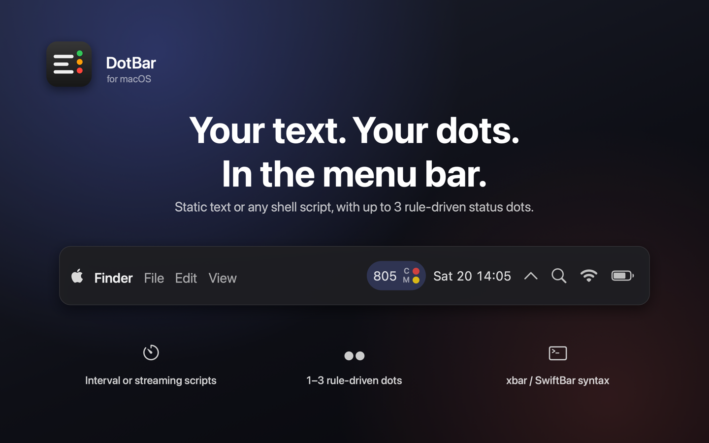
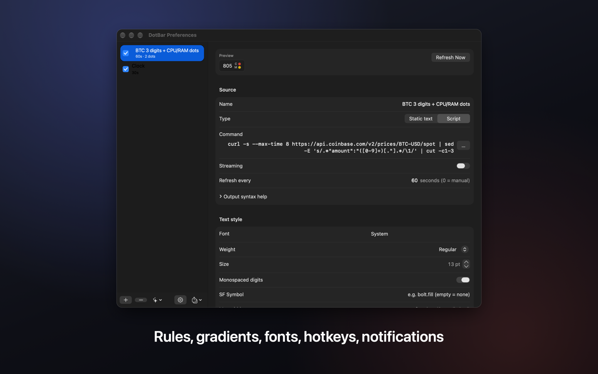
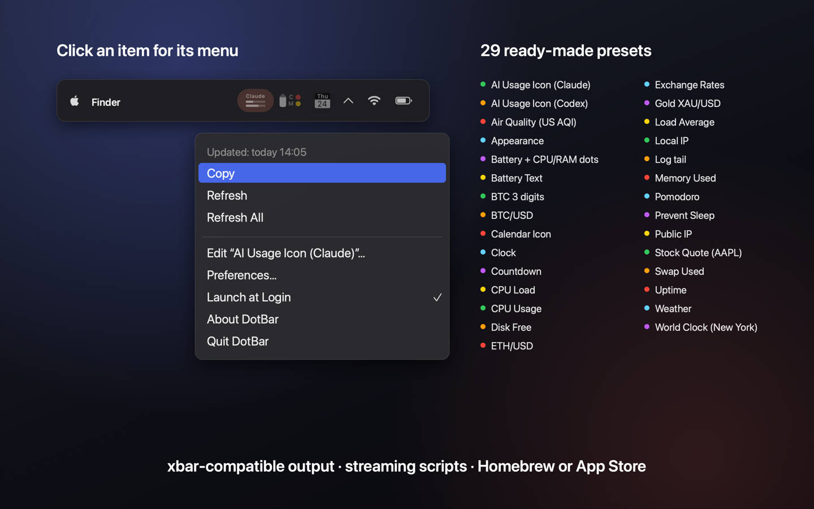
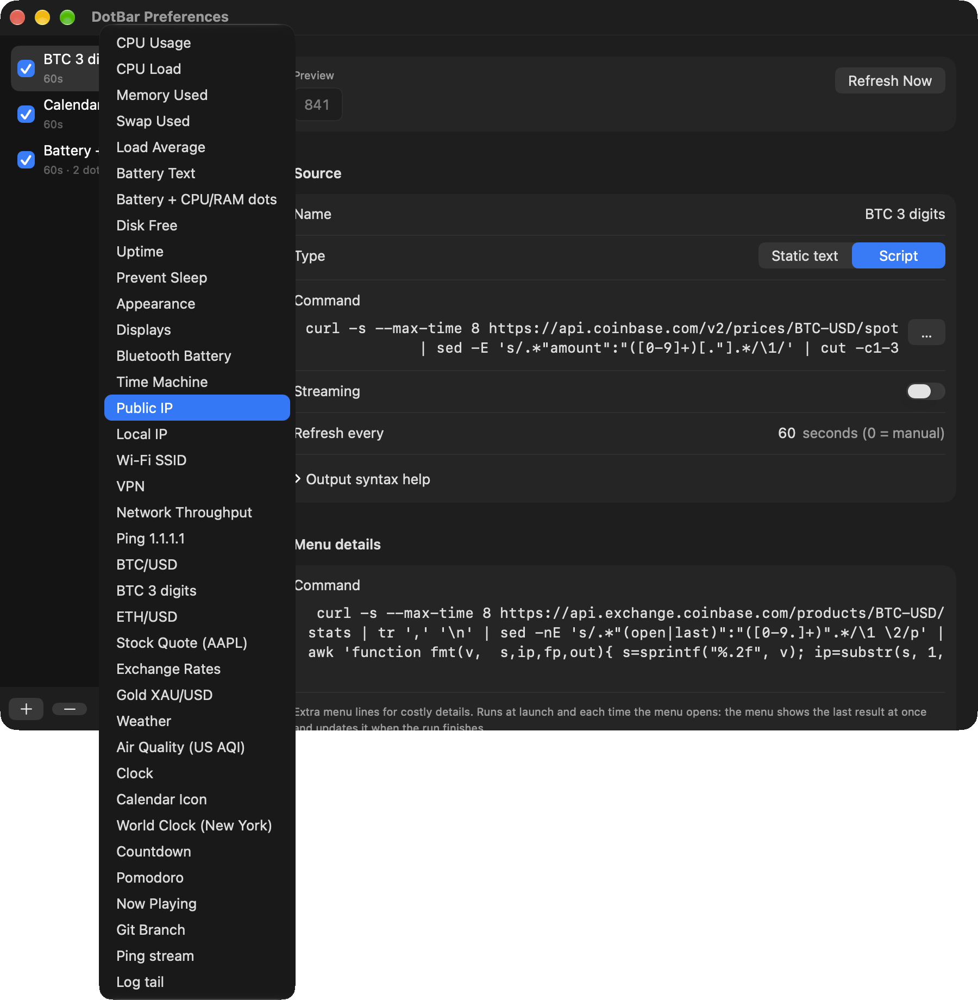

# DotBar

Custom text and status dots for the macOS menu bar. Minimal by design: ~600 KB binary, ~14 MB RAM idle, near-zero CPU.

  



https://github.com/user-attachments/assets/c993caa5-b90e-471b-bb1d-4a52682bb75c

| Preferences | Menu and recipes |
|---|---|
|  |  |



## What it does

- Show **static text** or the **output of a shell script** on an interval, or a **streaming** script that keeps running.
- **1–3 colored dots** stacked vertically next to the text. Colors follow rules you define: number range, regex, contains, equals, empty, script failed.
- **Font, size, weight, color** per item. Text color can also follow rules.
- **xbar / SwiftBar compatible** line syntax: `Text | color=red href=… bash=… refresh=true sfimage=… length=20`, `--` submenus, `---` separators, ANSI colors, `:emoji:` shortcodes.
- **JSON output** for full control: `{"text":"42","color":"#hex","dots":["#0f0","#f00"],"symbol":"bolt.fill","menu":[…],"badge":"3","mode":"dotsOnly","refresh":30,"action":{"url":"…"}}`.
- Left / ⌥ / middle click actions (menu, copy, run script, open URL). Right click is always the menu.
- **Combined mode**: all items in one menu bar slot with adjustable, even negative, gap.
- Notifications when text or a dot color changes. Per-item and global refresh hotkeys.
- Refresh on wake, stagger at launch, slower polling in Low Power Mode, never overlaps a slow script.
- `dotbar://` URL scheme: `open "dotbar://refresh?name=CPU%20Load"`, `dotbar://set?name=…&text=…`.
- Env vars for scripts: `DOTBAR_APPEARANCE`, `DOTBAR_LAST_RUN`, `DOTBAR_PREVIOUS_TEXT`, …
- Live reload when `items.json` or a file in the `scripts/` folder changes.
- Built-in recipes: CPU, memory, battery, IPs, Wi‑Fi, disk, BTC, ping, git branch, clock.

See [Recipes.md](Recipes.md) for scripts and the full output syntax.

## Install

```sh
brew install --cask ptrinh/tap/dotbar
```

Or download the notarized zip from [Releases](https://github.com/ptrinh/DotBar/releases). macOS 14+.

## Command line and AI agents

The cask also installs `dotbar`, a CLI for listing, adding and editing items. Writes are
validated, backed up, and show up in the running app at once.

```sh
dotbar list
dotbar add --recipe "CPU Usage"
dotbar test 'echo "42% | color=orange"'     # how DotBar reads a command's output
dotbar update "CPU Usage" --json '{"sparkline":30}'
```

Installed from the zip instead? `ln -s /Applications/DotBar.app/Contents/MacOS/DotBar /usr/local/bin/dotbar`.

Point an AI coding agent (Claude Code, Cursor, …) at [`AGENTS.md`](AGENTS.md): it covers the
CLI, the [JSON Schema](DotBar/Resources/items.schema.json) of `items.json`, the output syntax and
how to keep commands cheap. Then ask it for the item you want, e.g. *"add a menu bar item with
my open GitHub PRs"*.

## Build

Requires Xcode 16+ and [XcodeGen](https://github.com/yonaskolb/XcodeGen) (`brew install xcodegen`).

```sh
xcodegen generate
xcodebuild -project DotBar.xcodeproj -scheme DotBar -configuration Release -derivedDataPath build build
open build/Build/Products/Release/DotBar.app
```

Settings live in `~/Library/Application Support/DotBar/items.json`. Drop scripts in `~/Library/Application Support/DotBar/scripts/`.

## Design notes

- AppKit only in the menu bar path (custom `NSView` drawing, no layers, no SwiftUI). SwiftUI is used just for the Preferences window and released when it closes.
- Scripts run with `/bin/zsh -c`; PATH is resolved from your login shell once at launch.
- Release build uses `-Osize`, whole-module optimization, LTO and symbol stripping.

Inspired by [TextBar](https://github.com/richie5um/TextBar), [xbar](https://xbarapp.com) and [SwiftBar](https://github.com/swiftbar/SwiftBar).

## License

© 2026 Phil Trinh. All rights reserved. See [LICENSE](LICENSE).
